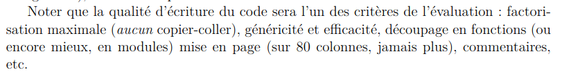

# To do

## Etat du nettoyage

- Les fonctions qui touchent à la BD ne sont plus vulnérables aux injections SQL
- Les fonctions qui touchent à la BD sont protégées contre les erreurs
- Les fonctions qui touchent à la BD sont protégées contre le changement du nom de la table

<!--  -->

- L'affichage des logs et des erreurs **dans la console** est plus clair
- Les routes sont protégées contre les erreurs
- Correction de bug: ajout de l'action '/gerante/compte/clients' dans le formulaire pour l'ajout d'un client.
- Ajout d'une image pour le compte client (`/images/client.png`)

<!--  -->

- Pour l'affichage des erreurs, utilisation de 'console.error' plutôt que 'console.log'
- Suppression de l'affichage des erreurs dans les fonctions de gestion de la BD. On laisse le serveur s'occuper de l'affichage des erreurs.

<!--  -->

- Ajout d'un rôle aux personnes (U pour USER, A pour ADMIN).
- Ajout d'une fonction 'getGerantes' pour récupérer la liste des gérantes.
- Gestion de l'erreur de connexion: identifiant incorrect ou mot de passe incorrect.
- Suppression de toutes les données en dur dans le code (sauf dans la dernière route incompréhensible de serveur.js).

<!--  -->

- Modification de l'image pour le compte gérente (`/images/gerente.png`)
- Gestion des erreurs dans les requêtes AJAX
- Suppression de la route `/gerante/compte/cadeaux` (inutile)

<!--  -->

- Problème avec le lien de connexion (/client/compte) résolue
- Correction d'erreur: La redirection de la page (lors de l'ajout d'un client/cadeau) a été ajoutée côté client.
- Ajout d'une fonction pour récupérer les cadeaux d'un certains id.
- Ajout d'un objet `client_connected` pour gérer les informations du client connecté.
- Ajout des fonctions `client_reset`, `client_init` et `client_add`.
- Pour l'instant, lorsqu'on appuie sur le bouton `Ajouter au panier`, les valeurs des points et du nombre de cadeaux dans le panier sont mis à jour.

<!--  -->

- Lors de l'ajout d'un cadeau, le serveur renvoie la liste des cadeaux que le client peut mtn acheter, en se basant sur point_h.
- Ajout de la classe '.list-cadeau' pour identifier le bloc (de class row) qui contient les cadeaux dans la page d'accueil.
- Affichage dynamique des cadeaux dans la page d'accueil lors de l'ajout d'un cadeau.

<!--  -->

- Dans le compte gérante, toutes les sections sont affichés pour les cadeaux, car elles sont toutes potentiellement modifiables.
- Ajout du champ image pour les cadeaux dans le compte gérante.
- Ajout de la possibilité d'uploader des fichiers lors de l'ajout des cadeaux par la gérante.
- Gestion des inputs en fonction de leur type (text, number, file, email, data, ...).
- Correction du chemin des images.

<!--  -->

- Correction de l'erreur dans le cas où le client ne s'est pas connecté.
- Correction bug: mauvaise classe pour le span image, dans la modification des cadeaux de la gérante.
- Ajout d'une fonction confettiAnimation pour ne pas faire boucler l'animation des confetti.
- Dropdownmenu passé en mode sombre.
- Les inputs ne dépassent plus de la card lors des modifications.
- Les boutons ne sont plus affichés par défaut, mais seulement lorsqu'on survole la card.
- Les titres des sections sont centrés et stylisés.
- Fix de la taille des images des card.
- Ombre + affichage des boutons lorsque l'on passe sur une card.

## A faire (style)

- [x] Rendre le texte du dropdown client blanc (ou plus lisibles)
- [x] Ajouter du padding entre les boutons (notamment modifier, supprimer etc dans le compte gérante)
- [x] Les inputs dépassent de la card lorsqu'on tente une modification.
- [x] N'afficher les boutons que lorsque la card est survolée (voir exemple sur le site de la fnac.)
- [x] Le titre des sections (comme 'Liste des clients', 'Liste des cadeaux') doit être centré et stylisé.
- [x] Fixer la taille des images des card, notamment pour les cadeaux, pcq là c'est du grand n'importe quoi.
- [ ] Ajouter du padding entre les boutons de l'ajout de client/cadeau dans la gérante.

## A faire (gestion d'erreur et affichage)

- [ ] Gérer l'affichage graphique des erreurs, un peu comme pour la page de connexion (par ex, avec des alertes).
- [ ] Lorsqu'il y a une erreur lors d'une modif de client, les input ne partent pas alors que le bouton valider part. Pour reproduire cette erreur: modifier un client -> changer le numéro avec plus de 10 chiffres -> valider.
- [x] Gérer l'erreur dans le cas où le client ne s'est pas connecté. Pour reproduire cette erreur: se déconnecter -> revenir à la page précédente -> recharger la page.

## A faire (correction et fonctionnalités)

- [ ] Certaines colonnes sont encore écrites en dur dans le code de gestion_personnes et gestion_cadeaux.
- [ ] Pour la suppression, il faut vérifier que le client existe avant de le supprimer. **UTILE ??**
- [ ] Modification des images des cadeaux.
- [ ] Problème lors de la mise à jour d'un client. Pour reproduire cette erreur: se connecter avec un client. Puis changer le nb de points côté gérante, et reload côté client. rien ne change.

## A faire (exigences du sujet)

- [ ] Ajouter les menus déroulants pour les caractéristiques des cadeaux. Ces caractéristiques doivent modifier l'id de la card qui représente le cadeau, id qui sera pris en compte lors de l'ajout du cadeau au panier.
- [x] au début de la connection, vérifier si la date = DATE_NAISSANCE du client, afficher animation
  - [ ] si oui, on **ajoute** des cadeaux spéciaux au client
    - _FIXME: Comment ajouter des cadeaux, alors que l'on affiche toujours tous les cadeaux dont les points est $\le$ points du client et que ces cadeaux spéciaux ne sont pas dans la BD, ou du moins, pas partagés._
- [ ] affichage des cadeaux actuellements dans le panier
  - [ ] **bouton** pour **supprimer** un cadeau du panier
  - [ ] **bouton** pour **vider** le panier
- [ ] **bouton** pour valider le panier
  - [ ] **mise à jour** du nombre de points
  - [ ] **vider le panier**

> [!WARNING]  
> Régler le problème de la date de naissance

<!-- Fix rule MD028 -->

> [!CAUTION]  
> 

## Page d'accueil

- [x] Affichage d'une image pour la connection de la gérante
  - [x] cliquer sur l'image $\to$ redirection vers la page de connection de la gérante
- [x] Affichage d'une image pour la connection du client
  - [x] cliquer sur l'image $\to$ redirection vers la page de connection du client

## Côté client

> [!NOTE]  
> Toutes les URI sont en `/client/...`

### Page de connection

- [x] formulaire: un **identifiant unique** avec un **mot de passe**
- [x] si l'identifiant existe et que le mot de passe est correct, on **redirige vers la page de compte**

<!-- Alignement -->

### Page de compte

- [x] affichage du **nombre de points**
- [ ] au début de la connection, vérifier si la date = DATE_NAISSANCE du client
  - [ ] si oui, on **ajoute** des cadeaux spéciaux au client
    - _FIXME: Comment ajouter des cadeaux, alors que l'on affiche toujours tous les cadeaux dont les points est $\le$ points du client et que ces cadeaux spéciaux ne sont pas dans la BD, ou du moins, pas partagés._
- [x] affichage de la **liste des cadeaux disponibles** pour elle
  - [x] CADEAUX.prix $\le$ CLIENT.points
- [x] **bouton** pour **ajouter** un cadeau dans le panier
- [x] **pseudo mise à jour** des points à chaque ajout dans le panier: c'est à dire qu'on affiche le nombre de points, et le nombre de points hypothétique à côté, à chaque ajout dans le panier.
  - [x] **affichage** du nombre de cadeaux dans le panier
- [x] chaque cadeau est représenté par une **image, un nom, un prix en points**
  - [x] **menu déroulant** pour spécifier les caractéristiques du cadeau

### Page du panier

- [ ] affichage des cadeaux actuellements dans le panier
  - [ ] **bouton** pour **supprimer** un cadeau du panier
  - [ ] **bouton** pour **vider** le panier
- [ ] **bouton** pour valider le panier
  - [ ] **mise à jour** du nombre de points
  - [ ] **vider le panier**

## Côté gérante

> [!NOTE]  
> Toutes les URI sont en `/gerante/...`

### Page de connection

- [x] formulaire: un **identifiant unique** avec un **mot de passe**
- [x] si l'identifiant existe et que le mot de passe est correct, on **redirige vers la page de compte**

### Page de compte

- [x] voir la liste des clients
- [x] ajouter un client
- [x] supprimer un client
- [x] modifier un client (points, ...)
- [ ] ajouter un cadeau
- [x] supprimer cadeau
- [x] modifier un cadeau
- [x] voir la liste des cadeaux

---

## Architecture

- 1 page `accueil.html`:

```html
<a href="https://localhost:8080/client/connexion">
  
</a>
<a href="https://localhost:8080/gerante/connexion">
  
</a>
```

- 1 page `connexion.ejs` (même page pour connexion client et gerante)  
  un formulaire avec `utilisateur` et `motdepasse`. Le nom d'utilisateur des clients est utilisé comme id dans la table `personnes`.
- 1 page `compte_client.ejs`:
  - affichage du nombre de points
  - affichage des cadeaux actuellements dans le panier (comment est stocké le panier ??)
  - bouton pour switcher entre la page de compte et la page d'achat des cadeaux
  - boutons pour supprimer / vider / valider le panier (comment faire pour mettre à jour les points lorsque le bouton est cliqué ??)
- 1 page `compte_client.ejs`:
  - bouton pour switcher entre la page de compte et la page d'achat des cadeaux
  - affichage de la liste des cadeaux disponibles pour elle
  - bouton pour ajouter un cadeau dans le panier
  - pseudo mise à jour des points à chaque ajout dans le panier
  - chaque cadeau est représenté par une image, un nom, un prix en points
  - menu déroulant pour spécifier les caractéristiques du cadeau
- 1 page `compte_gerante.ejs`:
  - menu de navigation, pour gérer soit les clients, soit les cadeaux
  - voir la liste des clients
  - boutons sur chaque client pour modifier / supprimer
  - bouton pour ajouter client -> redirection vers un formulaire ???
  - boutons pour ajouter (par caracteristiques) / supprimer (par cadeau_id) un cadeau
- module `gestion_personnes`:  
  voir liste / ajouter / supprimer / modifier client. Utilisé pour trouver les personnes (clients / gérante) lors de la connexion.
- module `gestion_cadeaux`: ajouter / supprimer cadeaux
- script `serveur.js`:
  - route `client/connexion` -> redirection vers la route `client/compte`
  - route `client/compte` -> render la page `compte_client.ejs`
  - route `client/achat` -> render la page `compte_client.ejs`
  - route `gerante/connexion` -> redirection vers la route `gerante/compte`
  - route `gerante/compte` -> render la page `compte_gerante.ejs`
